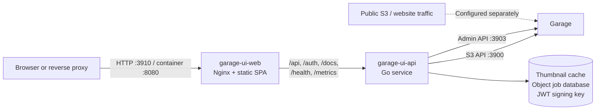

<p align="center">
  <a href="https://github.com/Noooste/garage-ui/actions/workflows/build.yml"></a>
  <a href="https://github.com/Noooste/garage-ui/actions/workflows/chart-release.yml"></a>
  <a href="https://codecov.io/gh/Noooste/garage-ui"></a>
  <a href="https://opensource.org/licenses/MIT"></a>
  <a href="https://go.dev/"></a>
  <a href="https://artifacthub.io/packages/search?repo=garage-ui"></a>
</p>

# Garage UI - Web Dashboard for Garage S3 Storage

A modern web interface to manage <a href="https://garagehq.deuxfleurs.fr/">Garage</a> object storage clusters. Browse buckets, manage access keys, monitor your cluster, all from your browser.

---

<table>
  <tr>
    <td></td>
    <td></td>
  </tr>
  <tr>
    <td></td>
    <td></td>
  </tr>
</table>

## Features

### Objects

- Browse bucket prefixes as folders with breadcrumbs and bounded back/forward navigation
- Upload one or many files, create directory markers, download, and batch-select objects or folders
- Copy or move selections within or between buckets, recursively copy/move/delete folders, and rename individual objects
- Track durable background operations with discovery and object/byte progress, cancellation, restart recovery, and per-object failure details
- Search recursively by object name and remember table sorting locally
- Preview images, video, PDF, and text; expand the complete preview card into an in-app fullscreen view
- Generate cached thumbnails on demand for JPEG, PNG, GIF, WebP, BMP, and TIFF images
- Copy configured public object URLs and generate time-limited presigned download URLs

### Buckets and access keys

- Create and delete buckets, inspect usage, and enforce size or object-count quotas
- Enable static website access and configure index and error documents
- Configure a default public URL template plus per-bucket URL overrides for copied links
- Create, inspect, enable, disable, expire, and delete S3 access keys
- Reveal credentials when authorized and manage read, write, and owner permissions per bucket

Public URL templates are presentation settings used only when Garage UI builds a
link for copying. They do not change Garage's `s3_web.root_domain`, reverse-proxy
rules, DNS, or bucket website access. Website access must be enabled separately
and the corresponding Garage endpoint must be exposed by your infrastructure.

### Cluster, security, and operations

- Dashboard for cluster health, bucket storage usage, and recent buckets
- Read-only cluster and node status, statistics, partition health, disk usage, and version details
- Administrator password, Garage admin-token, and OIDC login modes, with
  no-auth mode restricted to development
- Optional OIDC-team authorization with permissions scoped to buckets and object prefixes; see [access control](docs/access-control.md)
- Light/dark themes, responsive object workflows, collapsible navigation, and mobile-compatible copy controls
- Prometheus metrics endpoint, generated API documentation, file-backed secrets, and Garage v1/v2 Admin API compatibility

## Architecture

The Docker Compose deployment separates the browser-facing application from the
privileged backend:



- `garage-ui-web` contains only the compiled frontend and an unprivileged Nginx process.
- `garage-ui-api` owns Garage credentials, authentication, authorization, S3/Admin API access, and thumbnail generation.
- Only the Web service publishes a host port. The API is reachable only on the Compose network.
- Browser requests remain same-origin: Nginx proxies backend paths, avoiding a public API port and cross-origin cookie configuration.
- Nginx re-resolves the API service through Docker DNS, so the API container can be replaced without restarting the Web container.
- Thumbnail files, the embedded bbolt object-job database, and the generated
  JWT signing key live in a backend-only persistent volume. No external
  database service is required.

The repository retains the original all-in-one `Dockerfile` for the current Helm
chart and compatibility deployments. Compose builds the separated images from
`Dockerfile.web` and `Dockerfile.api`.

## Quick Start

### Prerequisites

- Docker & Docker Compose
- A running Garage cluster (v2.1.0+) - [setup guide](docs/garage-setup.md) if you need one

### 1. Clone & Configure

```bash
git clone https://github.com/Noooste/garage-ui.git
cd garage-ui
cp config.example.yaml config.yaml
```

Edit `config.yaml` with your Garage endpoints and admin token (from `garage.toml`).

### 2. Start

```bash
docker compose up -d garage-ui-web
```

Access at http://localhost:8080

## Deployment

### Docker Compose

```bash
docker compose up -d garage-ui-api garage-ui-web
```

The browser only connects to `garage-ui-web`. It serves the SPA and proxies API,
authentication, documentation, health, and metrics requests to the private
`garage-ui-api` service, so no CORS or separate public API endpoint is required.
Garage credentials, configuration, thumbnails, and job state are mounted only in
the API container.

### Kubernetes

```bash
helm repo add garage-ui https://helm.noste.dev/
helm install garage-ui garage-ui/garage-ui \
  --set garage.endpoint=http://garage:3900 \
  --set garage.adminEndpoint=http://garage:3903 \
  --set garage.adminToken=your-token
```

The chart creates a ClusterIP service on port 80. To try it out before setting up an ingress:

```bash
kubectl port-forward svc/garage-ui 8080:80
```

Then open http://localhost:8080

### Reusing your garage.toml

If you already have a running Garage instance, you can point Garage UI straight at your `garage.toml` and skip `config.yaml` entirely:

```bash
./garage-ui --garage-toml /etc/garage.toml
```

Garage UI reads the S3 endpoint, admin endpoint, admin token, and S3 region
straight from the TOML file. Admin username/password authentication is enabled
by default and requires credentials. To use the Garage admin token as the login
credential instead, set `GARAGE_UI_AUTH_ADMIN_ENABLED=false` and
`GARAGE_UI_AUTH_TOKEN_ENABLED=true`.

Production startup is rejected when admin, token, and OIDC authentication are
all disabled. Development mode may still run without authentication for local
work.

**Bind address handling:** Wildcard addresses like `0.0.0.0` or `[::]` are converted to `127.0.0.1` so the UI can reach Garage on localhost. Inside a container this won't work, so override the endpoints explicitly with environment variables or a config file.

**Docker:**

```bash
docker run -d -p 8080:8080 \
  -v /etc/garage.toml:/etc/garage.toml:ro \
  -e GARAGE_UI_GARAGE_TOML=/etc/garage.toml \
  -e GARAGE_UI_GARAGE_ENDPOINT=http://garage:3900 \
  -e GARAGE_UI_GARAGE_ADMIN_ENDPOINT=http://garage:3903 \
  noooste/garage-ui:latest
```

The endpoint overrides are needed because the container cannot reach `127.0.0.1` on the host.

**Combining flags:** Use `--garage-toml` for Garage connection values and `--config` for everything else (auth, CORS, logging, etc.):

```bash
./garage-ui --garage-toml /etc/garage.toml --config config.yaml
```

**Precedence order** (highest wins): built-in defaults < `garage.toml` < `config.yaml` < environment variables.

## Configuration

Minimum required config:

```yaml
server:
  port: 8080

garage:
  endpoint: "http://garage:3900"
  admin_endpoint: "http://garage:3903"
  admin_token: "your-admin-token"
  region: "garage"

auth:
  admin:
    username: "admin"
    password: "replace-with-a-strong-password"
```

Server bind host is configured by `server.host` (default: `0.0.0.0`). IPv6 literals like `::` and `::1` are also supported when explicitly configured.

```yaml
server:
  host: "0.0.0.0" # IPv4 wildcard
  port: 8080
```

Set `server.host: "::"` when the environment requires IPv6 binding.

See [config.example.yaml](config.example.yaml) for all options including authentication, CORS, and logging.

### Environment Variables

Override any config value with `GARAGE_UI_` prefix:

```bash
GARAGE_UI_SERVER_PORT=8080
GARAGE_UI_GARAGE_ENDPOINT=http://garage:3900
GARAGE_UI_GARAGE_ADMIN_TOKEN=your-token
GARAGE_UI_AUTH_ADMIN_USERNAME=admin
GARAGE_UI_AUTH_ADMIN_PASSWORD=replace-with-a-strong-password
```

Object sharing can use a separate public S3 endpoint for presigned URLs while
keeping normal data-plane traffic on the internal Garage endpoint. Website URLs
are derived from Garage's `[s3_web].root_domain`; mount `garage.toml` read-only
and configure the external protocol used by the reverse proxy:

```bash
GARAGE_UI_GARAGE_PRESIGN_ENDPOINT=https://s3-api.example.com
GARAGE_UI_GARAGE_TOML=/etc/garage-ui/garage.toml
GARAGE_UI_GARAGE_WEB_PROTOCOL=https
```

For example, `root_domain = ".example.com"` maps bucket `photos` to
`https://photos.example.com`. Public URLs are only returned for buckets with
website access enabled. `GARAGE_UI_GARAGE_PUBLIC_URLS` remains available as a
legacy per-bucket fallback when no web root domain is configured. The presign
endpoint host is part of the S3 signature and must be reachable by recipients
of the URL.

Object-list thumbnails are generated on demand and cached on disk. The split
API image stores UI state under `/var/lib/garage-ui`; mount that directory on
persistent storage so container recreation does not discard the cache, object
jobs, or generated JWT signing key. JPEG, PNG, GIF, WebP, BMP, and TIFF sources
are supported.
Defaults allow four concurrent generators, reject images
above 50 million pixels or source objects above 50 MiB, retain entries for 30
days, and cap the cache at 2 GiB. These can be overridden with:

```bash
GARAGE_UI_THUMBNAIL_ENABLED=true
GARAGE_UI_THUMBNAIL_CACHE_DIR=/var/lib/garage-ui/cache/thumbnails
GARAGE_UI_THUMBNAIL_CONCURRENCY=4
GARAGE_UI_THUMBNAIL_MAX_PIXELS=50000000
GARAGE_UI_THUMBNAIL_MAX_SOURCE_SIZE=52428800
GARAGE_UI_THUMBNAIL_CACHE_MAX_SIZE=2147483648
GARAGE_UI_THUMBNAIL_CACHE_MAX_AGE=720h
```

Recursive folder and multi-object operations run as durable background jobs.
The backend first expands selected prefixes into concrete S3 object keys, then
executes bounded concurrent copy, move, or delete requests. Keep the database
on persistent storage so in-progress jobs can resume after a backend restart:

```bash
GARAGE_UI_OBJECT_JOBS_ENABLED=true
GARAGE_UI_OBJECT_JOBS_DATABASE_PATH=/var/lib/garage-ui/cache/jobs.db
GARAGE_UI_OBJECT_JOBS_CONCURRENCY=4
GARAGE_UI_OBJECT_JOBS_MAX_ACTIVE=1
GARAGE_UI_OBJECT_JOBS_RETENTION=72h
```

See [object jobs](docs/object-jobs.md) for API contracts, path mapping,
authorization, conflict handling, and recovery semantics.

When `auth.jwt_private_key` is empty, the backend atomically creates
`<data_dir>/state/jwt-key.pem` with mode `0600` and reuses it on subsequent
starts. An explicitly configured PEM key or
`GARAGE_UI_AUTH_JWT_PRIVATE_KEY_FILE` continues to take precedence.

#### Loading sensitive values from files (`_FILE` suffix)

For Docker and Kubernetes secrets, sensitive env vars can be read from files instead of plain values. Set `{VAR}_FILE=/path/to/file` and garage-ui uses the file's contents (trailing CR/LF trimmed) as the value. If both `{VAR}` and `{VAR}_FILE` are set, `_FILE` wins and a warning is logged. A missing or unreadable file stops startup.

Supported vars:

- `GARAGE_UI_GARAGE_ADMIN_TOKEN_FILE`
- `GARAGE_UI_AUTH_ADMIN_USERNAME_FILE`
- `GARAGE_UI_AUTH_ADMIN_PASSWORD_FILE`
- `GARAGE_UI_AUTH_JWT_PRIVATE_KEY_FILE`
- `GARAGE_UI_AUTH_OIDC_CLIENT_ID_FILE`
- `GARAGE_UI_AUTH_OIDC_CLIENT_SECRET_FILE`

Example with Docker Compose secrets:

```yaml
services:
  garage-ui:
    image: noooste/garage-ui:latest
    environment:
      GARAGE_UI_AUTH_ADMIN_PASSWORD_FILE: /run/secrets/admin_password
    secrets:
      - admin_password

secrets:
  admin_password:
    file: ./admin_password.txt
```

This matches the convention used by the official Postgres and MySQL Docker images. Helm users don't need it; the chart already injects secrets via `existingSecret` references.

## Garage Configuration

Garage UI requires these settings in your `garage.toml`:

```toml
# Admin API (required for Garage UI)
[admin]
api_bind_addr = "0.0.0.0:3903"  # Default: 127.0.0.1:3903
admin_token = "your-admin-token" # Generate with: openssl rand -base64 32

# S3 API
[s3_api]
s3_region = "garage"             # Default: "garage"
api_bind_addr = "[::]:3900"      # Default: 127.0.0.1:3900
```

**Important:** The `admin_token` and `s3_region` in `garage.toml` must match your Garage UI `config.yaml`.

For complete Garage configuration, see the [official documentation](https://garagehq.deuxfleurs.fr/documentation/reference-manual/configuration/).

## Development

Backend (Go 1.25+):
```bash
cd backend
go run main.go --config ../config.yaml
```

Frontend (Node.js 25+):
```bash
cd frontend
npm install
npm run dev
```

API docs: http://localhost:8080/docs/index.html

## Troubleshooting

**Connection failed:**
```bash
curl http://localhost:3903/status -H "Authorization: Bearer your-token"
```

**Enable debug logs:**
```yaml
logging:
  level: "debug"
  format: "text"  # or "json"
```

## Roadmap

Roughly ordered by value. Candidates are limited to capabilities Garage actually
provides through its S3 or Admin API. Open an [issue](https://github.com/Noooste/garage-ui/issues)
to discuss the workflow and safety model before implementation.

- [x] **Fine-grained access control**: OIDC teams with per-bucket-prefix permissions, see [docs/access-control.md](docs/access-control.md)
- [x] **Object search**: recursive substring search across a bucket
- [x] **Bucket quotas**: size and object count limits from bucket settings
- [x] **Zero-config startup**: run straight from `garage.toml`, log in with the admin token
- [x] **Broad compatibility**: Garage v1 through latest, IPv6-only networks, secrets from files
- [x] **Inline object preview**: images, video, PDF, and text without downloading ([#60](https://github.com/Noooste/garage-ui/issues/60))
- [x] **Object sharing**: public URL mappings and time-limited presigned download links
- [x] **Image thumbnails**: bounded, cached thumbnail generation with configurable concurrency and pixel limits
- [x] **Separated runtime**: independently replaceable Web and API containers with a private backend network
- [x] **Single-object copy, move, and rename**: S3 server-side copy with overwrite protection and explicit delete-after-copy semantics
- [x] **Recursive and batch object jobs**: interactive destinations, multi-selection, durable progress, cancellation, and restart recovery
- [ ] **Bucket CORS editor**: view, validate, update, and remove S3 CORS rules
- [ ] **Lifecycle editor**: object expiration and incomplete multipart-upload cleanup rules supported by Garage
- [ ] **Multipart upload manager**: resumable uploads plus inspection, resume, abort, and cleanup of incomplete sessions
- [ ] **Bucket alias manager**: inspect and safely add or remove global bucket aliases
- [ ] **Scoped admin-token manager**: create expiring least-privilege Admin API tokens without using the master token
- [ ] **Visual cluster layout editor**: preview staged changes, show data movement, then apply or revert exactly once
- [ ] **Maintenance center**: workers, scrub status, metadata snapshots, repair operations, and block-resync errors with explicit safeguards
- [ ] **Observability views**: request rates, latency, errors, disk pressure, and resync health from Garage metrics
- [ ] **Admin audit log**: record who changed what; requires a durable external store because Garage does not provide this history

Garage currently does not implement S3 bucket/object ACLs, bucket policies, or
object versioning. Garage UI should not expose controls for those features until
the underlying Garage APIs support them. See Garage's
[S3 compatibility status](https://garagehq.deuxfleurs.fr/documentation/reference-manual/s3-compatibility/).

## License

MIT - see [LICENSE](LICENSE)

## Links

- [Issues](https://github.com/Noooste/garage-ui/issues)
- [Contributing](CONTRIBUTING.md)
- [Garage Docs](https://garagehq.deuxfleurs.fr/documentation/)
- [Garage Admin API v2](https://garagehq.deuxfleurs.fr/documentation/reference-manual/admin-api/)
- [Garage S3 compatibility](https://garagehq.deuxfleurs.fr/documentation/reference-manual/s3-compatibility/)
- [Garage cluster layout management](https://garagehq.deuxfleurs.fr/documentation/operations/layout/)
- [Garage durability and repairs](https://garagehq.deuxfleurs.fr/documentation/operations/durability-repairs/)

---

<p align="center">Made with ❤️ in France 🇫🇷</p>
